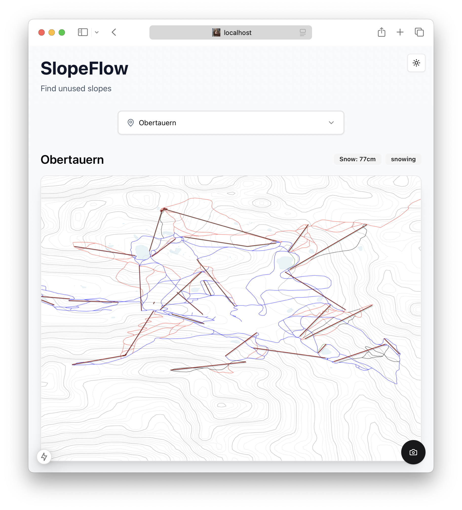

# TTF-2024 - SlopeFlow

Our entry for the [Tourism Tech Festival 2.0](https://tourism-technology.com/) (2024)



Snowflow is a delightful webapp to discover the slopes in your ski resort with
the least people and the most fun. For accurate live-reporting we process webcam
feeds and detect the number of people waiting at the ski-lifts with machine 
learning to precisely estimate the waiting times.


## Build and run with Docker

```bash
docker compose up --build
```

This will build the frontend which is accessible at http://localhost:3000 and backend at http://localhost:8000.

## Build and run locally

You will need the following requirements for the local build:

- [Python 3.12+](https://www.python.org/downloads/) and [Pip](https://pip.pypa.io/en/stable/installation/)
- [Node.js](https://nodejs.org/) and [npm](https://docs.npmjs.com/downloading-and-installing-node-js-and-npm) 


### Backend Setup

1. Set up Python environment:
```bash
cd backend
python -m venv venv
source venv/bin/activate 
pip install -r requirements.txt
```

2. Download required YOLO model files:
```bash
# Download YOLOv3 weights
wget https://pjreddie.com/media/files/yolov3.weights -P models/

# Download configuration file
wget https://raw.githubusercontent.com/pjreddie/darknet/master/cfg/yolov3.cfg -P models/

# Download COCO class names
wget https://raw.githubusercontent.com/pjreddie/darknet/master/data/coco.names -P models/
```

3. Adapt the `backend/data/ski_resorts.json` file to your liking. By default it already includes some of the best known resorts in Austria. Example schema:  

```json
{
  "resorts": [
    {
      "name": "Obertauern",
      "location": "Salzburg, Austria",
      "description": "One of Austria's most snow-sure winter sports destinations",
      "website": "https://www.obertauern.com"
    }
  ]
}
```

4. Load resort data
```bash
python scripts/load_resort_data.py
```

5. Finally start the server with
```bash
uvicorn app.main:app --reload
```

The backend will be available at http://localhost:8000.

### Frontend Setup

In a new terminal run:

```bash
cd frontend
npm install
npm run dev
```

The frontend will be available at http://localhost:3000.

## Development

### Code Style

We maintain a consistent code style through automated formatting:

- **Python**: We use either [ruff](https://github.com/astral-sh/ruff)
- **TypeScript/HTML/CSS**: We use [prettier](https://prettier.io/)

To further improve the code quality we use linters like [ESLint](https://eslint.org/) for TypeScript and [ruff](https://docs.astral.sh/ruff/) for Python.

Run the formatters before submitting any changes.

## Contributing

Contributions are quite welcome! You are awesome 😊✨
